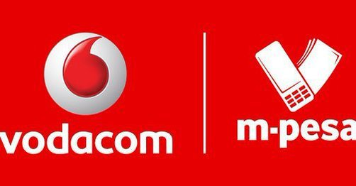
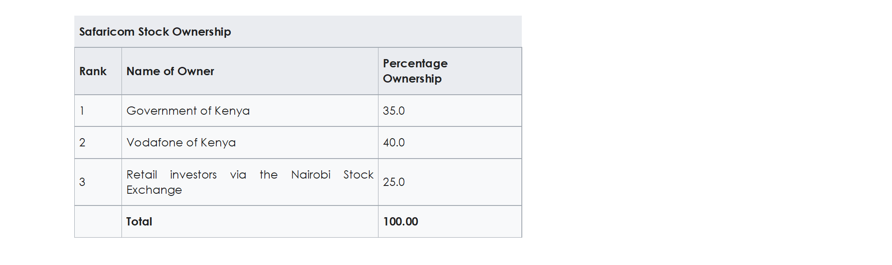
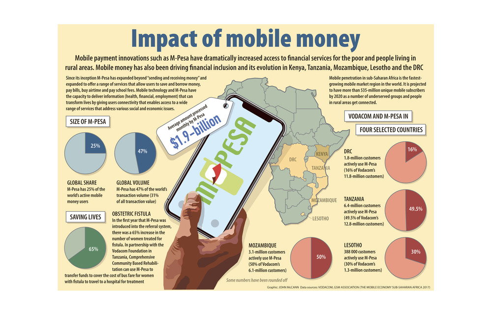
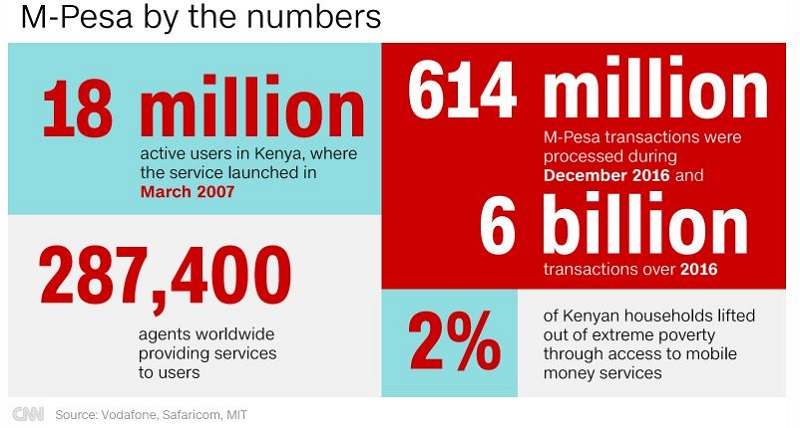
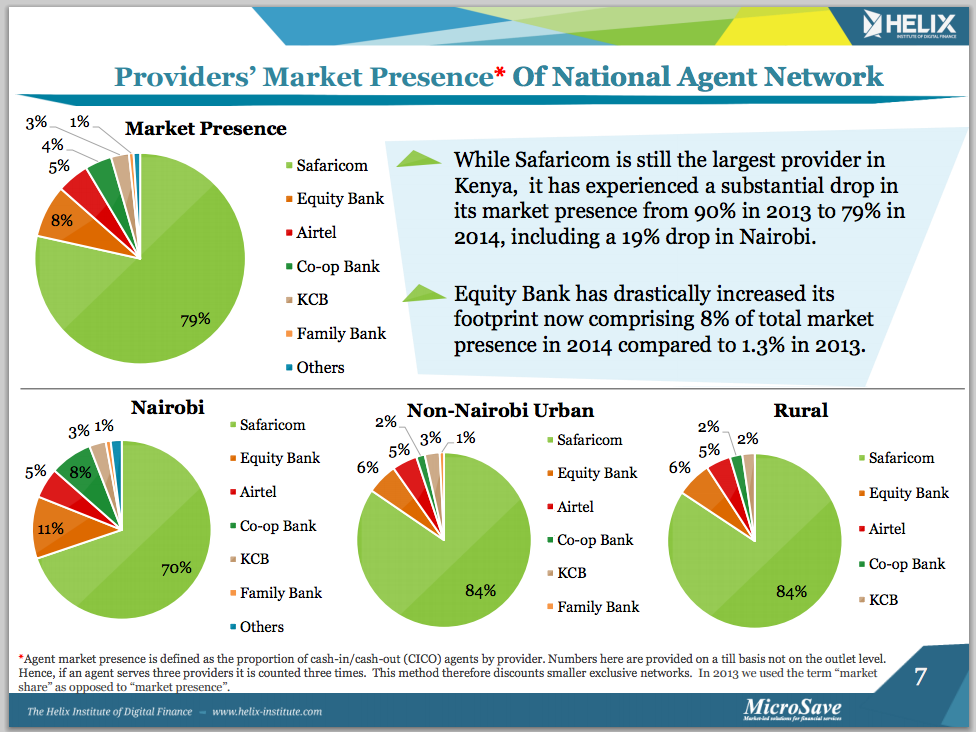

# FINTECH-CASE-STUDY-ASSIGNMENT
## TITLE : CASE STUDY OF M-PESA   MOBILE MONEY IN AFRICA

## Overview and Origin

Mobile Money is a mobile payments system that allow telecom mobile subscribers to be able to send and receive money through their phones. The conversion of cash into electronic value (and vice versa) happens at retail stores (or agents). All transactions are authorized and recorded in real-time using text messages
  
The mobile money has become an essential avenue through which the Africa’s population of 1.2 billion pay for goods and services and allows people to withdraw or deposit cash by just using their phone to send text.

The origin of mobile money in Africa started in 2007 in Nairobi Kenya by a telecom giant called Safaricom KENYA (subsidiary of Vodafone) who leveraging on their telecom network provides mobile money services to the people in remote locations. They branded the service as M-PESA (“M” for mobile and “PESA” for money in Swahili)

Vodafone in Kenya as at 2012 has about 15m users, is used by 70% of the adult population and has become central to the economy: around 25% of Kenya’s GNP flows through it.

Knowing that most people have a mobile and one can buy airtime to another, Ouko had the idea of setting a business to barter airtime against money.

Other telecoms operators in Africa like MTN and Moov/Etisalat have also joined to provide this service with MTN spreading across the continent.

Mobile money service is characterized by the following4 criteria: 
1.	Mobile money uses the mobile phone to transfer money and make payments to the underserved. 
2.	The service must offer at least one of the following products: domestic or international transfer, mobile payments including bill payment, bulk disbursement, and merchant payment. 
3.	The service must rely heavily on a network of transactional points outside bank branches and ATMs that make the service accessible to unbanked and underbanked people.
4.	Customers must be able to use the service without having been previously banked. Mobile banking services that offer the mobile phone are just another channel to access a traditional banking product and payment services linked to a current bank account or a credit card, such as Apple Pay and Google Wallet, and are thus not included. 
5.	The service must offer an interface for initiating transactions for agents and/or customers that is available on basic mobile devices. 

Common mobile money features are: 
1.	Cash in and cash out
2.	Peer to peer (P2P) money transfer 
3.	Voice (Airtime) and data top-up o Merchant payment
4.	Bill payment
5.	International remittance

The mobile money ecosystem can be described as follows:

Consumers: they register and use common mobile money services. Mainly if it is a network operator offer. They may not need to register for single peer to peer transfer if the service is provided by an electronic money provider (nonmobile network operator). In this case only the agents are registered. 

Mobile network operators: they provide all technological infrastructures (mobile network and service platforms) that allow mobile money services including notifications. 

Other mobile money service providers: they don’t operate mobile networks but have received regulators and central banks agreements to provide electronic money service. They need to use mobile networks infrastructures for notifications.
 
Agents and retailers: they usually facilitate cash-in, cash-out, peer to peer, top-up transactions by converting physical cash to mobile money and vice-versa; they handle account opening procedures and help educate consumers and maintain liquidity.

 Banks: they facilitate bulk disbursements and assist with Anti Money Laundering and sanction screenings, protect beneficiaries’ funds by holding actual cash in a trust account, and provide reports to regulators. 

Partner companies: they interface with mobile money service providers to facilitate payments for their products: bill payments, wage payments, etc. 

Regulators: they provide an enabling environment for mobile money, protecting the stability of the financial system and ensuring that regulations are implemented.

* Name of company
  Safaricom KENYA (subsidiary of Vodafone UK)

### When was the company incorporated?
Safaricom was formed in 1997 as a fully owned subsidiary of Telkom Kenya. In May 2000, Vodafone Group PLC of the United Kingdom acquired a 40% stake and management responsibility for the company.
In 2008, the government offered 25% of its shares to the public through the Nairobi Securities Exchange.

### Who are the founders of the company?
 The company was formed out of Telkom Kenya, a government owned telecom outfit.

### How did the idea for the company (or project) come about?
The idea was borne out of the need to provide micro-finance services through mobile phones to the underbanked and unbanked local communities in Kenya. It was originally designed as a system to allow microfinance-loan repayments to be made by phone, reducing the costs associated with handling cash.  After the pilot testing it was broadened to become a general money-transfer scheme when it was discovered that subscribers were using the application more for general money transfers rather than for microloans. 

### How is the company funded? How much funding have they received?
Although the initial project was partly funded by the UK Department for International Development of Vodafone Group,the company is now publicly owned and funded with the ownership structure as below

## Business Activities:

### What specific financial problem is the company or project trying to solve?
One of the infrastructural challenge banks in Africa has is lack of electricity to operates their banking hall in rural areas. This among other challenges poses a huge gap in delivering banking services to the remote location and as such flow of money from the urban areas to the remote locations because a problem and mostly expensive. Without adequate cash flow to the villagers who are predominately farmers, the movement of goods such as farms products becoming difficult and the live style of these people become poorer.

In order to bridge this gap, Safaricom a subsidiary of a government owned telecom first develop the application to enable microfinance-loan repayments to be made by phone which was later transformed to r peer to peer money transfer making phones became de facto electronic wallets

A worker in the city can send money to his family in the village without having to waste a day travelling on a rickety bus. Indeed, he can pay his family’s household bills directly from his phone. It is safer too: nobody wants to carry wads of currency on public transport.
Mobile money also gives its users—many of whom are poor and have no access to banks—a way to save small amounts of money. 

### Who is the company's intended customer?  Is there any information about the market size of this set of customers?

The intended customers are the unbanked and underbanked people in the population mostly people in the rural area that are likely to be uneducated. You don’t need to have bank account to be able to transfer money electronically from one location to another. All that is needed is a phone not even a smartphone.
In term of the market size, they control 46% of the market in Kenya, 17 million active subscribers and 287,000 agents

### What solution does this company offer that their competitors do not or cannot offer? (What is the unfair advantage they utilize?)

Unlike banks, the company was able to leverage on its telecom infrastructure and agents spreads across the country to provide financial services. The agents do not need to have a big office and the customers/subscribers do not need to have bank accounts for the exchange of money and other services to be consummated.

### Which technologies are they currently using, and how are they implementing them? 

Mobile money technology (MMT) is used for sending or receiving payment through mobile phones. It involves financial innovation that makes use of Short Message Service (SMS) technology to remunerate providers of different services using a commission system.

Nowadays, the technology has evolved to the use of USSD to provide this services. 

## Landscape:

### What domain of the financial industry is the company in?
   Payments/Billing (Remittances – Money transfer)
   
### What have been the major trends and innovations of this domain over the last 5-10 years?
The use of mobile money has grown exponentially over the past 10 years, making the region the global leader in mobile money innovation, adoption, and usage.
While access to traditional banking services remains almost a mirage for most Africans, in the past 10 years, the use of mobile phones has allowed millions to access mobile money services. With the introduction of the services, Mobile money accounts now surpass bank accounts in the region and greater financial inclusion has benefited large swathes of the population that remain unbanked including the poor, the young, and women.

With successful adoption in Kenya, M-Pesa product offered by Vodafone in Kenya are now offered in countries such as D.R. Congo, Egypt, Ghana, India, Kenya, Lesotho, Mozambique, Romania, and Tanzania. So also other telecom players have keyed into this service.

In order to penetrate the market further and offer qualitative services, operators are now working together to create an interconnected payment ecosystem. For instance, prospective agreements with MTN Group will allow both Orange Money and M-Pesa services to cover an even larger number of countries across the continent.

Also, Orange Money in Morocco teamed up with fellow telco MTN in November 2018 to create Mowali. Mowali is an interoperable digital payments infrastructure which has been designed to eventually support all 396 million registered mobile money users, causing huge market consolidation.
In addition to consolidation, the operators have also introduced the peer-to-peer (P2P) money transfer service which is one of a handful offered by firms dominating the region, including MTN Group, Globacom, Airtel, Vodafone, and PayPal

### What are the other major companies in this domain?
In Africa, the major companies are
1.	Tigo in Tanzania and Rwanda 
2.	Orange in Côte d’Ivoire, Mali, and Senegal ,Burkina Faso
3.	MTN Côte d’Ivoire and MTN Benin, Ghana, Nigeria, South Africa and other countries
4.	Moov in Côte d’Ivoire, Benin, Niger and  Togo 
5.	Safaricom Kenya and Tanzania ,Uganda
6.	Airtel in Zambia, Rwanda, and DRC 

## Results

### What has been the business impact of this company so far?

Of the 2.5 billion people as of 2012 that did not have a financial account, 1.7 billion had a mobile phone. Now, there were more mobile money accounts than traditional bank accounts in Kenya, Madagascar, Tanzania and Uganda. This has been the huge impact of mobile money in Kenya and in Africa as a whole.

In Kenya, mobile money was the game changer in bringing financial services to the middle class and the poor. In 2006, before the advent of mobile money, only 20 percent of Kenyan adults had access to financial services. By the end of 2010, three years after the introduction of mobile money, that share had jumped to 75 percent.
Kenya now has 25.3 million mobile subscribers, which is more than the total adult population, and 17.3 million registered mobile money  M-Pesa customers. M-Pesa conducts an estimated US $ 650 million per month in transactions, and according to World Bank and Safaricom projections, M-Pesa moved more than US $10 billion in 2011 and continue to grow every year.

The combination of widespread cellular communication and the ability to transfer money instantly, securely, and inexpensively are together leading to enormous changes in the organization of economic activity, family relations, and risk management and mitigation, among other things. A decade ago, family members in different parts of Kenya had a very limited scope of communicating with relatives in distant parts of the country, and they faced even greater difficulties in sending or receiving remittances medium through which were unreliable and prone to leakage (sending via bus drivers and friends) or expensive (using money transfer services or the Kenyan Post Office).

Mobile money is beginning to fill this gap by offering financial services over mobile phones, from simple person-to-person transfers to more complex banking services. 

### What are some of the core metrics that companies in this domain use to measure success? How is your company performing, based on these metrics?
   
One of the metrics is the revenue generation from the business and In 2019, They have been able to generate a Revenue of  KES 74.99bn , Operating income of KES79.91 Billion  and net income of KES 63.4 billion ($627.4 million USD).

The other metric is the number of subscribers and agents. Today they have more than 287,000 agents across Kenya and more than 17 million subscribers.

### How is your company performing relative to competitors in the same domain?
Being the pioneer of Mobile Money in Africa, Vodafone accounted for   45.6% of  all activity, according to the GSM Association. They are the leader in the market space.

 Today, M-PESA has more than 17 million subscribers in Kenyans (over two-thirds of the adult population). Approximately 31% of the country’s GDP flows through it.
Before M-PESA, in 2006, only 20% of Kenyan adults had access to financial services. By 2010 this number had risen to 75%. A World Bank report similarly found that M-PESA users are approximately 33% more likely to have savings than their peers.

## Recommendations

### If you were to advise the company, what products or services would you suggest they offer? (This could be something that a competitor offers or use your imagination!)
My recommendation would be to add the following products to their offerings

Collections– They should have an API that allows companies especially financial institutions to integrate a M-Pesa checkout button to accept Mobile Money payments on your e-commerce site. So through the mobile app their subscribers can make payment on for products on these e-commerce websites.
In addition they can also  develop products that can allows mass payment to multiple beneficiaries at the same time. This will enable them to break into market segments such as sport betting companies that is growing in Africa.

### Why do you think that offering this product or service would benefit the company?
greater percentage of consumer products are generally being conducted on the web. Integrating the Mobile App to these e-commerce website to allow their subscribers be able to make payment would enable them increase their market shares. It would also help the e-commerce companies to be able to reach the remote location to sell their products. It is going to be win-win for both parties.

### What technologies would this additional product or service utilize?

 I would recommend that they leverage on Blockchain and Cryptocurrency technology

### Why are these technologies appropriate for your solution?

 These are emerging technology that any serious operators should embraces.

## References 
https://www.thenationalnews.com/business/mobile-money-is-booming-in-africa-as-countries-shun-cash-amid-the-pandemic-1.1040097

https://en.wikipedia.org/wiki/African_MobileMoney

https://workshop1.cases.som.yale.edu/mpeso/background/mobile-money
https://workshop1.cases.som.yale.edu/sites/default/files/cases/MPeso/w17129.pdf
https://workshop1.cases.som.yale.edu/sites/default/files/cases/MPeso/Mobile%20money%20Getting%20to%20scale%20in%20emerging%20markets.pdf
https://www.icyte.com/saved/voices.mckinseyonsociety.com/922730?key=3e34a8066624793820161f3ce2e4ce653ad66409
https://workshop1.cases.som.yale.edu/sites/default/files/cases/MPeso/WPS6025.pdf
https://en.wikipedia.org/wiki/Safaricom#History_2
https://blogs.imf.org/2019/02/14/fintech-in-sub-saharan-africa-a-potential-game-changer/
https://www.fintechfutures.com/2020/03/inclusion-innovation-and-mobile-money-in-sub-saharan-africa/
http://documents1.worldbank.org/curated/en/832831500443778267/pdf/117403-WP-KE-Tool-6-7-Case-Study-M-PESA-Kenya-Series-IFC-mobile-money-toolkit-PUBLIC.pdf
https://mg.co.za/article/2018-06-01-00-m-pesa-ushers-in-a-new-wave-of-banking-infrastructure-in-africa/
